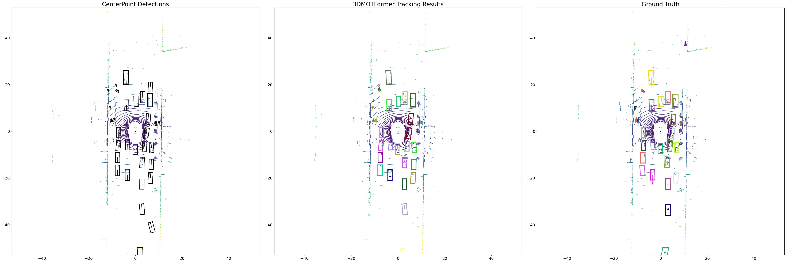
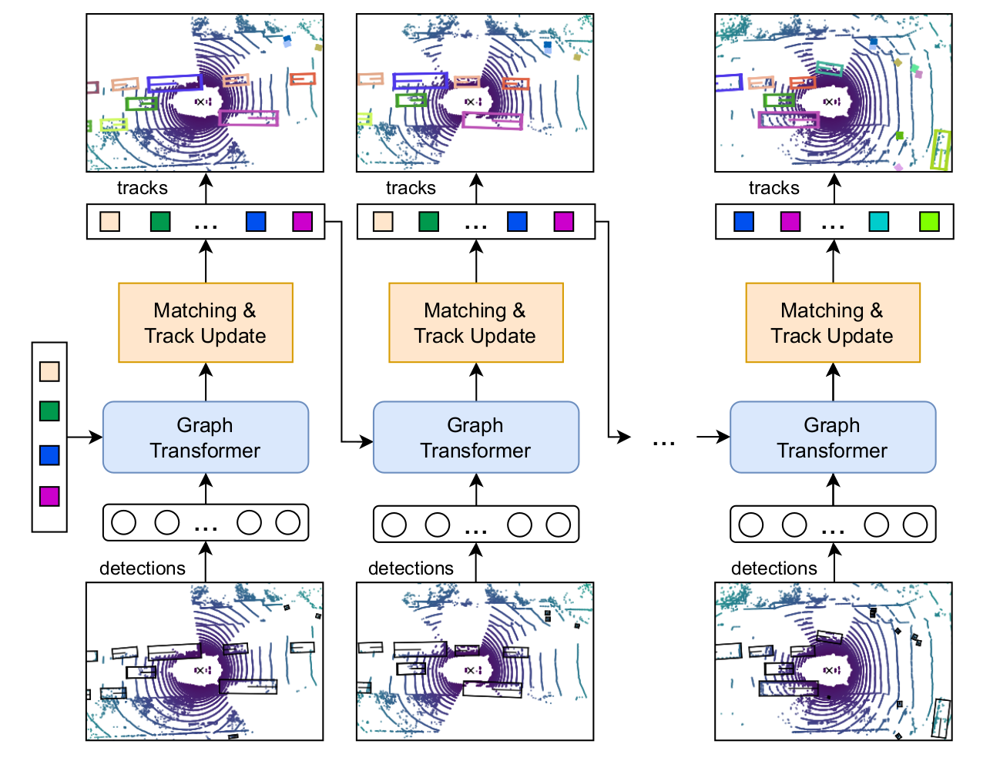

# [ICCV2023] 3DMOTFormer: Graph Transformer for Online 3D Multi-Object Tracking

This is the official implementation of the ICCV2023 paper
> **3DMOTFormer: Graph Transformer for Online 3D Multi-Object Tracking**  
> Shuxiao Ding, Eike Rehder, Lukas Schneider, Marius Cordts, Juergen Gall

A demo of scene c525507ee2ef4c6d8bb64b0e0cf0dd32:


## Abstract
Tracking 3D objects accurately and consistently is crucial for autonomous vehicles, enabling more reliable downstream tasks such as trajectory prediction and motion planning. Based on the substantial progress in object detection in recent years, the tracking-by-detection paradigm has become a popular choice due to its simplicity and efficiency. State-of-the-art 3D multi-object tracking (MOT) works typically rely on non-learned model-based algorithms such as Kalman Filter but require many manually tuned parameters. On the other hand, learning-based approaches face the problem of adapting the training to the online setting, leading to inevitable distribution mismatch between training and inference as well as suboptimal performance. In this work, we propose 3DMOTFormer, a learned geometry-based 3D MOT framework building upon the transformer architecture. We use an Edge-Augmented Graph Transformer to reason on the track-detection bipartite graph frame-by-frame and conduct data association via edge classification. To reduce the distribution mismatch between training and inference, we propose a novel online training strategy with autoregressive and recurrent forward pass as well as sequential batch optimization. Using CenterPoint detections, our approach achieves state-of-the-art 71.2% and 68.2% AMOTA on nuScenes validation and test split. In addition, a trained 3DMOTFormer model generalizes well across different object detectors.

<p align="center">  </p>

## Installation
First, clone this repository and the git submodules:
```
git clone --recurse-submodules https://github.com/dsx0511/3DMOTFormer.git
```

### Conda environment
Basic installation:
```
conda create -n 3dmotformer python==3.7.13
conda activate 3dmotformer
conda install pytorch==1.13.1 torchvision==0.14.1 torchaudio==0.13.1 pytorch-cuda=11.7 -c pytorch -c nvidia
pip install nuscenes-devkit matplotlib pandas motmetrics==1.1.3
```

Install pytorch geometric and dependencies:
```
conda install pyg -c pyg
pip install pyg_lib torch_scatter torch_sparse torch_cluster torch_spline_conv -f https://data.pyg.org/whl/torch-1.13.0+cu117.html
```

### Third-party dependencies
To enable using BEV IoU as matching distance for target assignment, please install the `iou3d_nms` CUDA operation from [CenterPoint](https://github.com/tianweiy/CenterPoint):

```
conda install -c conda-forge cudatoolkit-dev==11.7.0
cd CenterPoint/det3d/ops/iou3d_nms/
python setup.py install
```

To apply NMS during data pre-processing following [SimpleTrack](https://github.com/tusen-ai/SimpleTrack), please install:

```
cd SimpleTrack/
pip install -e .
```

## Data preparation

### 1. Download nuScenes
Please download nuScenes [here](https://www.nuscenes.org/download). Only the metadata for trainval and test set of v1.0 are necessary. Place nuScenes in your `$NUSCENES_DIR`.

### 2. Get detection results from an existing 3D detector
3DMOTFormer is compatible with any 3D detectors. 
You will first get the detection results as dataset to train 3DMORFormer.

#### CenterPoint (recommended)
Most existing MOT paper use [CenterPoint](https://github.com/tianweiy/CenterPoint) as public detection due to its better performance.
Following this [Github issue](https://github.com/tianweiy/CenterPoint/issues/249), you can download CenterPoint public detections that are provided by the authors:
- [With flip augmentation](https://mitprod-my.sharepoint.com/:f:/g/personal/tianweiy_mit_edu/Eip_tOTYSk5JhdVtVzlXlyABDPnGx9vsnwdo5SRK7bsh8w?e=vSdija) (68.5 NDS val performance)
- [Without flip augmentation](https://mitprod-my.sharepoint.com/:f:/g/personal/tianweiy_mit_edu/Er_nsH9Z2tRHnptBFJ_ompAByE3zu4E88xae691xyS6q_w?e=UqTmU2) (66.8 NDS val performance)

To reproduce our results reported in the paper, please use the one [with flip augmentation](https://mitprod-my.sharepoint.com/:f:/g/personal/tianweiy_mit_edu/Eip_tOTYSk5JhdVtVzlXlyABDPnGx9vsnwdo5SRK7bsh8w?e=vSdija).

#### NuScenes public detections
[Nuscenes tracking benchmark](https://www.nuscenes.org/tracking) provided several public detections:
- [MEGVII](https://www.nuscenes.org/data/detection-megvii.zip) (62.8 NDS val performance)
- [PointPillars](https://www.nuscenes.org/data/detection-pointpillars.zip) (44.8 NDS val performance)
- [Mapillary](https://www.nuscenes.org/data/detection-mapillary.zip) (36.9 NDS val performance)

#### Other detectors
If you consider using detections from another 3D detector. Please follow the instructions of their specific source code and export the results as a json file following the nuScenes output format. For example, if you want to use [BEVFusion](https://github.com/mit-han-lab/bevfusion) detections, you can follow this [Github issue](https://github.com/mit-han-lab/bevfusion/issues/233) to get the json files.

### 3. Data pre-processing
Please rename the json files with detection results for train, validation and test set as `train.json`, `val.json` and `test.json` and place them in the same folder (`$DETECTION_DIR`).
Use this [script](./generate_data.py) to pre-process the detections:
```
python generate_data.py --dataset_dir=$NUSCENES_DIR --detection_dir=$DETECTION_DIR --output_dir=$PKL_DATA_DIR --apply_nms
```
This converts the json format into pkl files for all key frames and store them in the `$PKL_DATA_DIR`, which will be loaded by the dataloader during training and evaluation.

## Training and evaluation
Change the the corresponding fields to the paths to your `$NUSCENES_DIR` and `$PKL_DATA_DIR` in the [config file](./config/default.json).
To start the training, run 
```
python train.py -c config/default.json
```
This will also run the evaluation on the valiation split after every epoch.

## Experimental results
Results using different detectors as input:

| Detector | NDS | mAP | AMOTA | AMOTP | MOTA | IDS | FRAG |
|:-:|:-:|:-:|:-:|:-:|:-:|:-:|:-:|
| CenterPoint | 68.5 | 61.5 | 0.712 | 0.496 | 0.556 | 438 | 529 |
| BEVFusion | 72.9 | 70.2 | 0.725 | 0.539 | 0.609 | 593 | 499 |
| MEGVII | 62.8	| 51.9 | 0.641 | 0.639 | 0.535 | 328 | 497 |


## License
See [LICENSE](./LICENSE) for more details.
